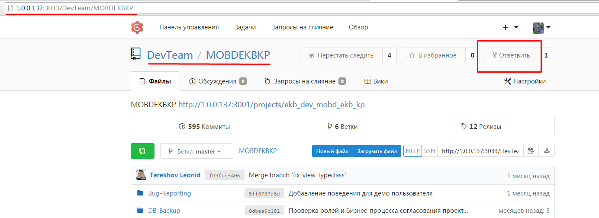
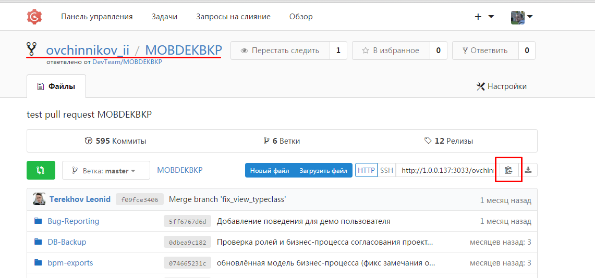

# Краткое руководство по git[1](#git)
## Грфический клиент SmartGit[2](#smartgit)
### Сохраняем копию проекта локально
Заходим в локальный менеджер репозиториев[3](#repman) по адресу `1.0.0.137:3033` и выбираем репозиторий, над которым будет вестись работа. Нажимаем `Ответвить`

Репозиторий должен появиться в списке репозиториев пользователя[4](#usrep)

Именно этот репозиторий нужно сохранять в качестве локального[5](#locrep). Для этого необходимо скопировать его полный адрес (http-ссылка)

<a id="git" href="ft1">1</a>: About git

<a id="git" href="ft2">2</a>: About smartgit

<a id="git" href="ft3">3</a>: About repositories

<a id="git" href="ft4">4</a>: About (remote) user repositories

<a id="git" href="ft5">5</a>: About local repositories
